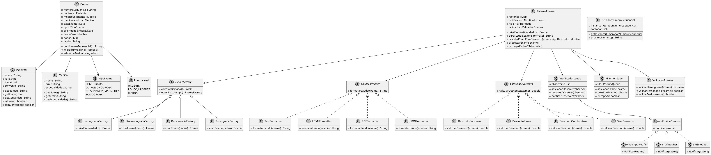

# Equipe: José Lucas Herminio Paulo Leite
# Padrões de Projeto Utilizados

## 1. FACTORY METHOD PATTERN
**Requisitos atendidos:** R3, R2

**Onde aplicado:**
- Classes `ExameFactory` e suas implementações (`HemogramaFactory`, `UltrassonografiaFactory`, etc.)
- Integração com `GeradorNumeroSequencial` (Singleton interno)

**Como resolve os problemas:**
- **R3:** Permite criar diferentes tipos de exames sem modificar o código cliente. Novos tipos (como `Tomografia`) podem ser adicionados facilmente.
- **R2:** Cada factory utiliza o gerador de números sequenciais para garantir unicidade.
- **Extensibilidade:** Novos tipos de exames podem ser adicionados criando novas factories sem impactar o código existente.

**Benefícios:**
- Centraliza a lógica de criação de exames.
- Facilita manutenção e extensão.
- Garante que cada tipo de exame tenha suas características específicas.

---

## 2. STRATEGY PATTERN
**Requisitos atendidos:** R4, R7

**Onde aplicado:**
- Formatação de Laudos: Interface `LaudoFormatter` com implementações para `Text`, `HTML`, `PDF`, `JSON`.
- Cálculo de Descontos: Interface `CalculadorDesconto` com diferentes políticas de desconto.

**Como resolve os problemas:**
- **R4:** Permite gerar laudos em diferentes formatos de forma intercambiável. Novos formatos podem ser adicionados sem modificar código existente.
- **R7:** Aplica diferentes políticas de desconto (convênio 15%, idoso 8%, campanhas especiais) de forma flexível.

**Benefícios:**
- Flexibilidade na escolha de algoritmos em tempo de execução.
- Facilita adição de novos formatos e tipos de desconto.
- Código limpo e bem estruturado.

---

## 3. OBSERVER PATTERN
**Requisitos atendidos:** R6, R9

**Onde aplicado:**
- Classe `NotificadorLaudo` como `Subject`.
- Interface `NotificationObserver` com implementações para `WhatsApp`, `Email`, `SMS`.

**Como resolve os problemas:**
- **R6:** Notifica automaticamente o paciente quando um laudo é emitido, usando diferentes canais.
- **R9:** Integra-se com o fluxo principal do sistema para notificações automáticas.
- **Extensibilidade:** Novos mecanismos de notificação podem ser adicionados facilmente.

**Benefícios:**
- Desacoplamento entre emissão de laudos e notificações.
- Permite múltiplas notificações simultâneas.
- Facilita manutenção e adição de novos canais.

---

## Mapeamento Completo de Requisitos

| Requisito | Como é Atendido                                     | Padrão Principal     |
|-----------|-----------------------------------------------------|----------------------|
| R1        | Método `carregarDadosCSV()` no `SistemaExames`      | Sistema Principal    |
| R2        | `GeradorNumeroSequencial` integrado às `Factories`  | Factory Method       |
| R3        | Factory Method para diferentes tipos de exames      | Factory Method       |
| R4        | Strategy para formatação de laudos                  | Strategy             |
| R5        | Classe `ValidadorExames` com métodos específicos    | Sistema Principal    |
| R6        | Observer para notificações automáticas              | Observer             |
| R7        | Strategy para cálculo de descontos                  | Strategy             |
| R8        | Classe `FilaPrioridade` com `enum PriorityLevel`    | Sistema Principal    |
| R9        | Classe `SistemaExames` coordena todo o fluxo        | Sistema Principal    |
| R10       | Histórico de operações e logs no sistema            | Sistema Principal    |

---

